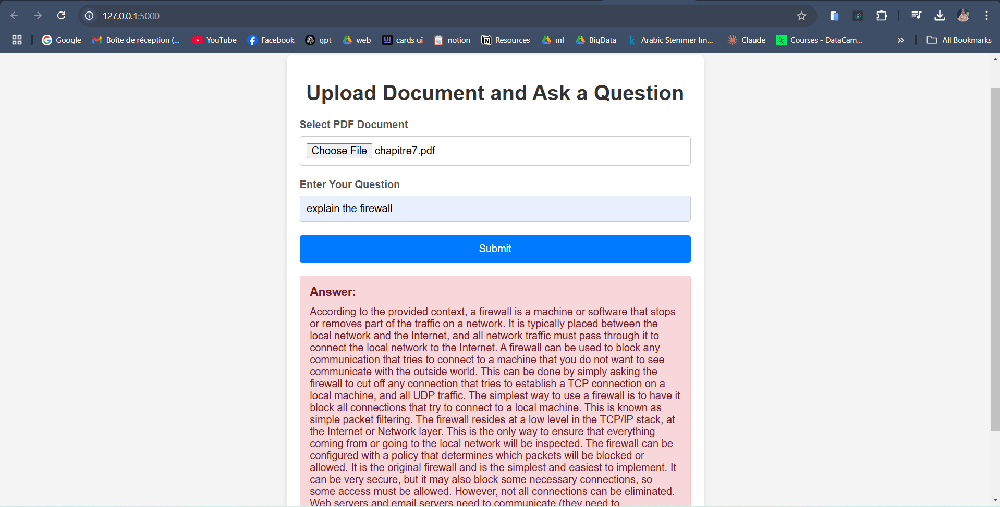

# AI-Powered PDF Retrieval Web App

## Overview
This project is a web application built with Flask that allows users to upload PDF documents and ask questions about their content. The application uses **LangChain**, **ChromaDB**, and **Ollama** embeddings to process documents and retrieve relevant answers using **Retrieval-Augmented Generation (RAG)**.

## Features
- Upload PDF documents dynamically
- Process and split text into smaller chunks for better retrieval
- Store document embeddings in **ChromaDB**
- Use **Ollama embeddings** for vector similarity search
- Answer user queries based on document content

## Demo
<p align="center">
    
</p>

## Technologies Used
- **Flask** (Backend Web Framework)
- **LangChain** (Document Processing & Retrieval)
- **ChromaDB** (Vector Database)
- **Ollama** (Embeddings for text retrieval)
- **HTML/CSS** (Frontend Interface)
- **Unstructured.io** (Document Parsing)

## Installation
### Prerequisites
Ensure you have **Python 3.12** installed and set up a virtual environment.

### Steps to Install
1. Clone the repository:
   ```bash
   https://github.com/OussamaBenSlama/Ollama-RAG-PDF.git
   cd ollama_RAG_PDF
   ```
2. Create a virtual environment and activate it:
   ```bash
   python -m venv .venv
   source .venv/bin/activate  # On Mac/Linux
   .venv\Scripts\activate  # On Windows
   ```
3. Install dependencies:
   ```bash
   pip install -r requirements.txt
   ```
4. Start the Flask server:
   ```bash
   python app.py
   ```
5. Open `http://127.0.0.1:5000` in your browser.

## Usage
1. Upload a PDF file through the web interface.
2. Enter a question related to the document.
3. The system processes the document and retrieves the most relevant answer.

## License
This project is licensed under the MIT License.

## Author
**Oussama Ben Slama**  
[GitHub](https://github.com/OussamaBenSlama) 
[LinkedIn](https://www.linkedin.com/in/oussama-ben-slama/)

